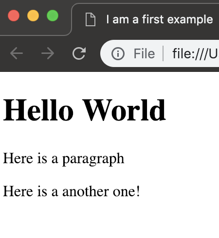
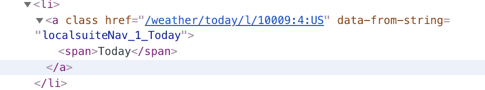

# Chapter 5: Parsing HTML

In this chapter, we will learn how to write scripts that parse HTML files on the web and extract useful information. Before we dive into working with HTML files, let us quickly review what they typically look like.

Let us jump right into looking into a basic example
```html
<!DOCTYPE html>  
<html>  
    <head>
      <title>I am a first example</title>
    </head>
    <body>
        <h1> Hello World </h1>
        <p> Here is a paragraph </p>
        <p> Here is a another one!</p>
    <body>
</html>
```

HTML code consists of nested tags of form `<tag> content </tag>` (There are special tags that need not be closed). For example, the `<h1>` tag indicates that the content within is a header, whereas the `<p>` tag encloses a paragraph.

You can find this file in `hello.html`, open it with your browser to see the following output.



The goal of HTML parsing is to extract content from these files. For instance, we could extract all texts within the `<h1>` tags to generate a rudimentary table of content.

Before we jump into actually parsing, we need to worry about understanding more complex html files. As an example, go to [weather.com](https://weather.com/), a website that does not look too complex at first glance.
Using your favorite web browser, view the sites source (in Chrome: right click and `View page source`).
You will see a huge mess of html code that is difficult to understand.
This where most modern browser's come in. On Google Chrome for instance, you can right click a particular object and click on `Inspect`.
If you do this for the `Today` button on the top of the page, you can see the corresponding HTML code containing the the text and the link of the button:




### Exercise
- What is the `classname` of the `div` tag that contains the box entitled *Our Photo Gallery Picks*?

<details><summary>Show Solution</summary>
<p>
cm-small-content wx-media-group
</p>
</details>


## Bash

## Python

BeautifulSoup

## Exercises

## Additional Exercise
- [Weather Forecast](https://github.com/InsightDataScience/Parsing-Workshop/tree/master/exercises/weather_forecast)
