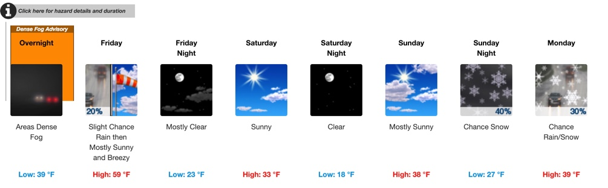

# Weather Forecast

In order to practice HTML parsing, we want to extract data from the weather forecast for New Jersey from
[weather.gov](https://forecast.weather.gov/MapClick.php?lat=39.6133&lon=-74.7286#.XF0mKc9KjBI).

Make sure to inspect the website's HTML code with your browser to understand
the structure of the underlying html file.

For this exercise, we are mostly interested in the 7 day forecast:

## Exercises

1. Write a script that extracts the 7 day forecast and prints it to the command line. Make sure to print both daily highs as well as lows.
2. Write a script that outputs the average high and low temperatures over the next 7 days.
3. Write a script that determines the next day that is forecasted to be sunny. If no such day exists, your script should print "No sun in the next 7 days :("
